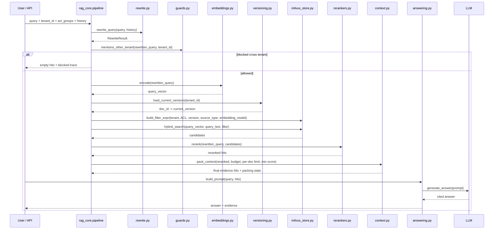
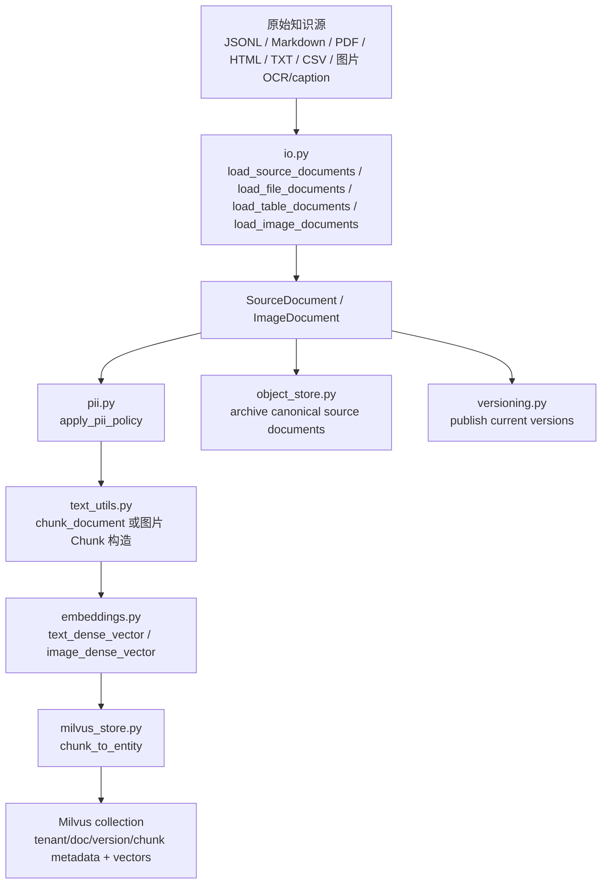
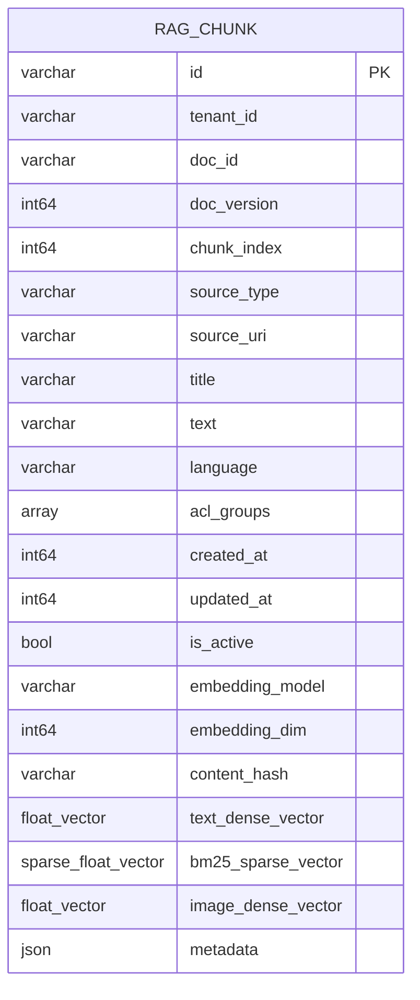
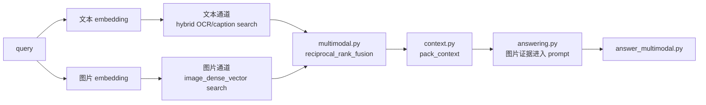
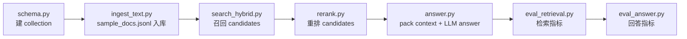

# 08-industrial-rag 代码设计框架

<style>
.mermaid {
  min-height: 1720px;
}
</style>

这个文件用于回答一个复现问题：如果从零写一个工业级 RAG，应该先写哪些模块、模块之间怎么连、每个模块负责什么。

项目不是按“一个脚本跑到底”的 demo 写法组织，而是把生产 RAG 拆成 6 层：

1. 数据接入层：把 JSONL、Markdown、PDF、HTML、表格、图片元数据统一转成 `SourceDocument` / `ImageDocument`。
2. 文档处理层：PII 处理、结构化 chunk、embedding、image embedding、版本发布。
3. 存储检索层：Milvus schema、dense/sparse/image 向量字段、metadata filter、upsert/search。
4. 检索编排层：query rewrite、tenant/ACL/version/source filter、hybrid search、rerank、context packing。
5. 回答与 API 层：prompt、citation answer、FastAPI `/search` `/query` `/feedback`。
6. 评估运维层：retrieval eval、answer eval、diagnosis、benchmark、monitoring、release gate、smoke tests。

## 1. 总体分层图

```mermaid
flowchart TB
    subgraph L0["外部输入"]
        TXT["data/sample_docs.jsonl"]
        IMG["data/sample_images.jsonl"]
        FILES["PDF / HTML / Markdown / TXT"]
        TABLES["CSV / TSV"]
        USER["用户 Query / API Request"]
        FEEDBACK["线上反馈 feedback"]
    end

    subgraph L1["入口脚本层：projects/08-industrial-rag/*.py"]
        INGEST["ingest_text.py<br/>ingest_markdown.py<br/>ingest_files.py<br/>ingest_tables.py<br/>ingest_image.py"]
        SCHEMA["schema.py"]
        SEARCH["search_dense.py<br/>search_sparse.py<br/>search_hybrid.py<br/>search_image.py<br/>search_multimodal.py"]
        RERANK["rerank.py"]
        ANSWER["answer.py<br/>answer_multimodal.py"]
        API["serve.py"]
        EVAL["eval_retrieval.py<br/>eval_answer.py<br/>release_gate.py"]
        OPS["monitor_events.py<br/>benchmark_latency.py<br/>diagnose_*.py<br/>collection_stats.py"]
    end

    subgraph L2["核心库层：rag_core"]
        TYPES["types.py<br/>核心数据结构"]
        CONFIG["config.py<br/>配置和路径"]
        IO["io.py<br/>多格式解析"]
        PII["pii.py<br/>敏感信息策略"]
        TEXT["text_utils.py<br/>chunk / hash / lexical"]
        EMB["embeddings.py<br/>BGE / CLIP backend"]
        STORE["milvus_store.py<br/>schema / index / search"]
        OBJ["object_store.py<br/>canonical archive"]
        VER["versioning.py<br/>current version registry"]
        PIPE["pipeline.py<br/>text RAG 编排"]
        MM["multimodal.py<br/>图文融合 RRF"]
        REWRITE["rewrite.py<br/>query rewrite"]
        GUARD["guards.py<br/>跨租户防护"]
        RERANKERS["rerankers.py<br/>lexical / BGE rerank"]
        CONTEXT["context.py<br/>context packing"]
        ANS["answering.py<br/>prompt / LLM answer"]
        AUTH["auth.py<br/>API auth context"]
        EVENTS["events.py<br/>runtime event log"]
        READY["readiness.py<br/>服务就绪检查"]
        CITE["citations.py<br/>回答评估规则"]
    end

    subgraph L3["外部系统 / 本地状态"]
        MILVUS["Milvus / Milvus Lite<br/>collection + indexes"]
        MODELS["Embedding / Rerank / CLIP 模型"]
        LLM["NewAPI-compatible LLM"]
        RUNTIME["runtime/*.jsonl"]
        OBJECTS["object_store/canonical/*.jsonl"]
    end

    TXT --> INGEST
    IMG --> INGEST
    FILES --> INGEST
    TABLES --> INGEST
    SCHEMA --> STORE
    INGEST --> IO
    INGEST --> PII
    INGEST --> TEXT
    INGEST --> EMB
    INGEST --> STORE
    INGEST --> OBJ
    INGEST --> VER
    STORE --> MILVUS
    EMB --> MODELS
    OBJ --> OBJECTS
    VER --> OBJECTS

    USER --> SEARCH
    USER --> ANSWER
    USER --> API
    SEARCH --> STORE
    SEARCH --> EMB
    SEARCH --> MM
    RERANK --> RERANKERS
    ANSWER --> PIPE
    ANSWER --> ANS
    API --> AUTH
    API --> PIPE
    API --> EVENTS
    PIPE --> REWRITE
    PIPE --> GUARD
    PIPE --> EMB
    PIPE --> STORE
    PIPE --> VER
    PIPE --> RERANKERS
    PIPE --> CONTEXT
    ANS --> LLM
    EVENTS --> RUNTIME
    FEEDBACK --> API

    EVAL --> CITE
    EVAL --> PIPE
    EVAL --> SEARCH
    OPS --> EVENTS
    OPS --> STORE
    OPS --> CONTEXT
```



## 2. 复现时的推荐编码顺序

按下面顺序写，能从最小可运行逐步扩展到工业级。

```mermaid
flowchart LR
    A["1 types.py<br/>定义 SourceDocument / Chunk / SearchHit"]
    B["2 config.py<br/>集中管理 Milvus、模型、阈值、路径"]
    C["3 milvus_store.py<br/>schema + index + upsert + search"]
    D["4 io.py + text_utils.py<br/>读数据、切 chunk、算 chunk id/hash"]
    E["5 embeddings.py<br/>文本 embedding，图片 embedding 可后置"]
    F["6 ingest_text.py<br/>跑通入库闭环"]
    G["7 search_dense.py / sparse / hybrid<br/>跑通召回"]
    H["8 rerankers.py + rerank.py<br/>二阶段排序"]
    I["9 context.py + answering.py + answer.py<br/>组证据、prompt、回答"]
    J["10 pipeline.py<br/>把 rewrite/filter/search/rerank/context 串成统一函数"]
    K["11 serve.py<br/>提供 API"]
    L["12 eval / monitor / release_gate<br/>质量门禁和运维"]
    M["13 multimodal<br/>image vector + 图文融合 + multimodal answer"]

    A --> B --> C --> D --> E --> F --> G --> H --> I --> J --> K --> L --> M
```



## 3. 核心模块职责

| 模块 | 你复现时要写出的能力 | 当前文件 |
| --- | --- | --- |
| 数据结构 | 定义文档、图片文档、chunk、检索结果、trace、context packing 统计 | `rag_core/types.py` |
| 配置 | 从环境变量加载 Milvus URI、collection、模型后端、维度、chunk 参数、阈值、API token | `rag_core/config.py` |
| 文件解析 | 读取 JSONL、Markdown、HTML、PDF、TXT、CSV/TSV，并转成统一文档对象 | `rag_core/io.py` |
| 文本处理 | normalize、tokenize、稳定 hash、结构化 chunk，不拆断表格和 fenced code block | `rag_core/text_utils.py` |
| PII | 检测邮箱、手机号、身份证/API key 形态，并按 warn/redact/fail 策略处理 | `rag_core/pii.py` |
| 向量模型 | 封装文本 embedding、图片 embedding、设备和 dtype 解析 | `rag_core/embeddings.py` |
| Milvus 存储 | 创建 schema、dense/sparse/image index、metadata filter、upsert、dense/sparse/hybrid/image search | `rag_core/milvus_store.py` |
| 对象归档 | 保存 canonical 文档，支持删除 tombstone 和从归档重建索引 | `rag_core/object_store.py` |
| 文档版本 | 维护每个 doc 的 current version，避免默认查询命中过期版本 | `rag_core/versioning.py` |
| 查询改写 | 把带历史的追问改写成独立检索 query | `rag_core/rewrite.py` |
| 权限护栏 | 拦截明显跨租户问题，构造 tenant/ACL/source/version filter | `rag_core/guards.py`、`rag_core/milvus_store.py` |
| 检索编排 | 串联 rewrite、embedding、Milvus hybrid search、rerank、context packing，并产出 trace | `rag_core/pipeline.py` |
| 重排 | lexical baseline 或 BGE reranker，把粗召回候选重排 | `rag_core/rerankers.py` |
| Context packing | 按 token/字符预算、每文档 chunk 上限、最低 rerank 分选择证据 | `rag_core/context.py` |
| 回答生成 | 根据 evidence 生成 prompt，调用 NewAPI-compatible LLM，保留 citation | `rag_core/answering.py` |
| API 鉴权 | 从 header 解析 tenant、ACL、token，服务端控制权限上下文 | `rag_core/auth.py` |
| 事件日志 | 记录 retrieval、answer、feedback 事件，并脱敏 PII | `rag_core/events.py` |
| 就绪检查 | 检查 Milvus collection、schema 字段、向量维度和配置脱敏输出 | `rag_core/readiness.py` |
| 回答评估 | citation accuracy、拒答识别、term coverage、faithfulness 规则 | `rag_core/citations.py` |
| 多模态融合 | 对文本通道和图片通道结果做 reciprocal rank fusion | `rag_core/multimodal.py` |

## 4. 文本 RAG 主链路



`answer.py` 和 `serve.py` 都应该尽量复用 `retrieve_and_rerank()`，不要在入口脚本里重复实现复杂检索逻辑。

## 5. 入库链路



复现时最低要求是先跑通 `ingest_text.py`：读 JSONL、PII 策略、chunk、embedding、`chunk_to_entity()`、`upsert_entities()`。PDF/HTML/表格/图片都可以在这个基础上扩展。

## 6. Milvus Collection 设计



关键设计点：

- `tenant_id`、`acl_groups`、`doc_version`、`source_type`、`embedding_model` 都是查询过滤条件，不应该只放在不可检索的原始 JSON 里。
- `text_dense_vector` 负责语义召回，`bm25_sparse_vector` 负责关键词召回，`image_dense_vector` 负责图片召回。
- `embedding_model` 和 `embedding_dim` 用来避免新旧 embedding 混查。
- `metadata` 放页码、heading path、表格列、图片 bbox、linked doc 等可展示信息。

## 7. 多模态 RAG 扩展



复现时可以把多模态作为最后一层：先把图片 OCR/caption 当文本 chunk 入库，再补 `image_dense_vector` 和 RRF 融合。

## 8. 入口脚本到模块的映射

| 入口脚本 | 属于哪条链路 | 主要调用模块 |
| --- | --- | --- |
| `schema.py` | 初始化 | `config.py`、`milvus_store.py` |
| `ingest_text.py` | 文本入库 | `io.py`、`pii.py`、`text_utils.py`、`embeddings.py`、`milvus_store.py`、`object_store.py`、`versioning.py` |
| `ingest_markdown.py` | Markdown 入库 | `io.py`、`text_utils.py`、`embeddings.py`、`milvus_store.py` |
| `ingest_files.py` | 多文件入库 | `io.py`、`text_utils.py`、`embeddings.py`、`milvus_store.py` |
| `ingest_tables.py` | 表格入库 | `io.py`、`text_utils.py`、`embeddings.py`、`milvus_store.py` |
| `ingest_image.py` | 图片入库 | `io.py`、`embeddings.py`、`milvus_store.py`、`object_store.py` |
| `search_dense.py` | dense 检索教学 | `embeddings.py`、`milvus_store.py` |
| `search_sparse.py` | sparse/BM25 检索教学 | `embeddings.py`、`milvus_store.py` |
| `search_hybrid.py` | hybrid 检索教学 | `embeddings.py`、`milvus_store.py` |
| `search_image.py` | 图片向量检索教学 | `embeddings.py`、`milvus_store.py` |
| `search_multimodal.py` | 图文融合检索 | `embeddings.py`、`milvus_store.py`、`multimodal.py`、`context.py`、`rewrite.py` |
| `rerank.py` | 二阶段排序教学 | `rerankers.py` |
| `answer.py` | 文本回答 | `pipeline.py`、`answering.py` |
| `answer_multimodal.py` | 多模态回答 | `search_multimodal.py`、`context.py`、`answering.py` |
| `serve.py` | API 服务 | `auth.py`、`pipeline.py`、`answering.py`、`events.py`、`readiness.py` |
| `eval_retrieval.py` | 检索评估 | `pipeline.py`、`milvus_store.py`、`io.py` |
| `eval_answer.py` | 回答评估 | `citations.py`、`io.py` |
| `diagnose_retrieval.py` | 召回诊断 | `milvus_store.py`、`rerankers.py`、`text_utils.py` |
| `diagnose_context.py` | context 诊断 | `pipeline.py`、`context.py` |
| `benchmark_latency.py` | 延迟拆解 | `answer.py` / `answer_multimodal.py` 主链路 |
| `monitor_events.py` | 线上事件聚合 | `events.py`、`runtime/*.jsonl` |
| `release_gate.py` | 上线门禁 | `eval_retrieval.py`、`eval_answer.py` |

## 9. 从零复现的最小闭环

最小闭环不是一次性复制所有文件，而是先让一条链路真实工作：



对应命令：

```bash
source .venv/bin/activate
python projects/08-industrial-rag/schema.py --reset --explain
python projects/08-industrial-rag/ingest_text.py --explain
python projects/08-industrial-rag/search_hybrid.py "RAG 检索变慢时应该排查哪些环节？" --acl-group support --explain
python projects/08-industrial-rag/rerank.py "RAG 检索变慢时应该排查哪些环节？" --acl-group support --show-candidates
python projects/08-industrial-rag/answer.py "RAG 检索变慢时应该排查哪些环节？" --acl-group support --show-trace
python projects/08-industrial-rag/eval_retrieval.py
python projects/08-industrial-rag/eval_answer.py
```

复现时每完成一个阶段，都应该能回答：

- 输入是什么：文件、query、tenant、ACL、history。
- 输出是什么：chunks、Milvus entities、SearchHit、reranked hits、context、answer、metrics。
- shape 是什么：向量维度、字段名、JSONL 行结构、API request/response。
- 质量怎么验证：recall/MRR/nDCG、citation accuracy、latency、权限泄露检查。

## 10. 文件树视角

```text
projects/08-industrial-rag/
├── data/                         # 教学样本和 eval 样本
├── rag_core/                     # 可复用核心库
│   ├── types.py                  # dataclass 数据模型
│   ├── config.py                 # 环境变量和默认配置
│   ├── io.py                     # JSONL / 文件 / 表格 / 图片元数据解析
│   ├── text_utils.py             # chunk、hash、token、RRF baseline
│   ├── pii.py                    # PII 检测与脱敏策略
│   ├── embeddings.py             # BGE / CLIP embedding backend
│   ├── milvus_store.py           # Milvus schema、index、filter、search
│   ├── object_store.py           # canonical 文档归档和删除 tombstone
│   ├── versioning.py             # current version 发布/取消发布
│   ├── rewrite.py                # query rewrite
│   ├── guards.py                 # tenant 安全护栏
│   ├── rerankers.py              # rerank backend
│   ├── context.py                # context packing 与诊断
│   ├── pipeline.py               # 文本 RAG 主编排
│   ├── multimodal.py             # 多模态结果融合
│   ├── answering.py              # prompt 和 LLM 生成
│   ├── auth.py                   # API 鉴权上下文
│   ├── events.py                 # runtime 事件日志
│   ├── readiness.py              # /ready 检查
│   └── citations.py              # 回答评估工具
├── schema.py                     # 创建 collection
├── ingest_*.py                   # 入库入口
├── search_*.py                   # 检索入口
├── rerank.py                     # 重排入口
├── answer*.py                    # 回答入口
├── serve.py                      # FastAPI 服务
├── eval_*.py                     # 离线评估
├── diagnose_*.py                 # 调试诊断
├── monitor_events.py             # 监控聚合
├── release_gate.py               # 上线门禁
├── smoke_*.py                    # 面向模块/链路的验收测试
├── Dockerfile / docker-compose.yml
└── README.md
```
